# Task 1: Initial Server setup

## Table of Contents
- [Previous Steps](#previous-steps)
- [Creating New User](#creating-new-user-and-removing-root-login-access)
- [Disabling Root SSH](#disabling-root-user-ssh-for-better-security)
- [Configuring Firewall](#configuring-firewall)
- [Updating System](#updating-system-and-installing-core-components)
- [Enabling Core Services](#enabling-core-services)


---
### Previous steps:

- Logged in to Digital Ocean control panel.
- Created droplet.
- Operating System: Rocky Linux 10.
- IPv6 enabled along with IPv4.  

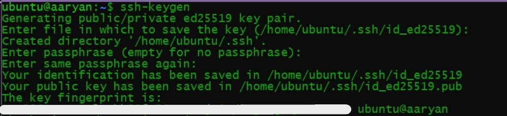

- Added SSH key. 
- Finalize: Set hostname and Created Droplet.  

---  

[Confirmation]: Can access rocky linux through command line    
I can log in as root user  

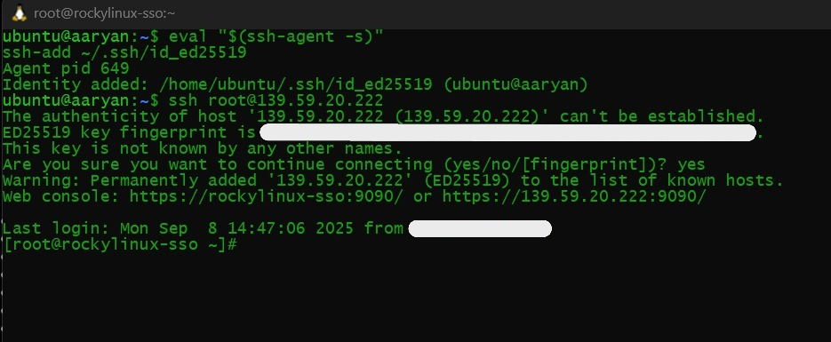  

---
### Creating new user and removing root login access

``` bash
# Created a new user and set a strong password
adduser rlsso
passwd ----

# Add the user to the 'wheel' group to grant sudo access
usermod -aG wheel rlsso

# Copy SSH key so new user can login with ssh
rsync --archive --chown=rlsso:rlsso ~/.ssh /home/rlssso
```

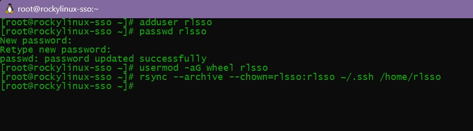
---

### Disabling root user SSH for better security
```
Edit /etc/ssh/sshd_config and change  
PermitRootLogin yes to PermitRootLogin no
```
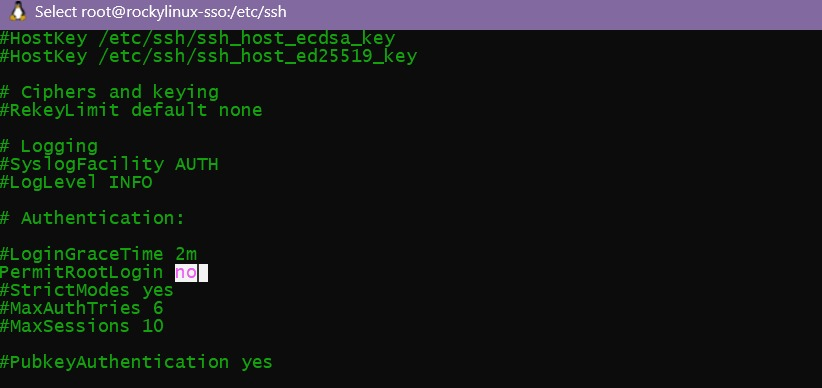  
Once we restart sshd service, we can no longer login as root user

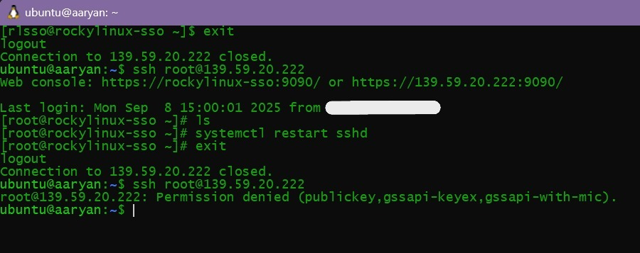

---  
  
### Configuring Firewall

```bash
# Enable and start the firewall
sudo systemctl enable --now firewalld

# Allow essential services permanently
sudo firewall-cmd --permanent --add-service=http
sudo firewall-cmd --permanent --add-service=https
sudo firewall-cmd --permanent --add-port=8080/tcp # For Keycloak
sudo firewall-cmd --permanent --add-service=ssh

# Apply the new rules
sudo firewall-cmd --reload
```
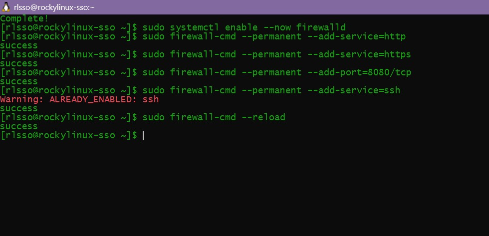  

Firewall reloaded  
Then we recheck which services have been allowed
```bash
sudo firewall-cmd --list-all
# lists all firewall services which are allowed
```

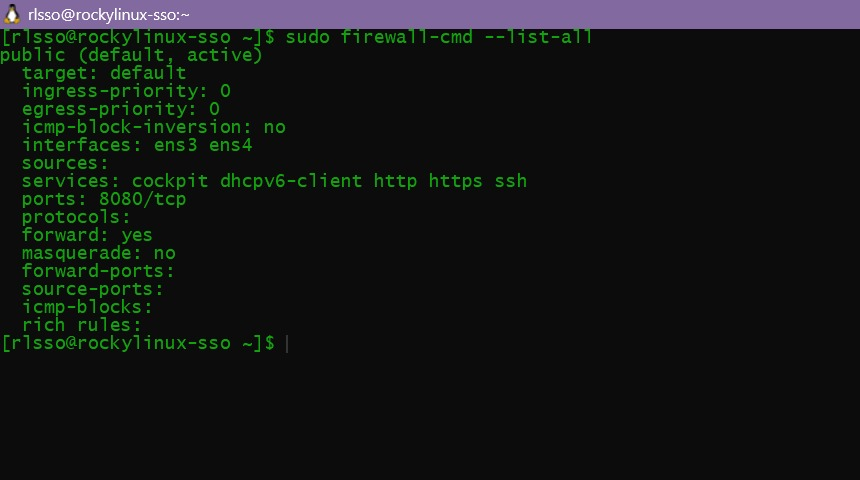  

We have all firewall services set up correctly.

---

### Updating system and installing core components
```
# Update all system packages
sudo dnf update -y
```
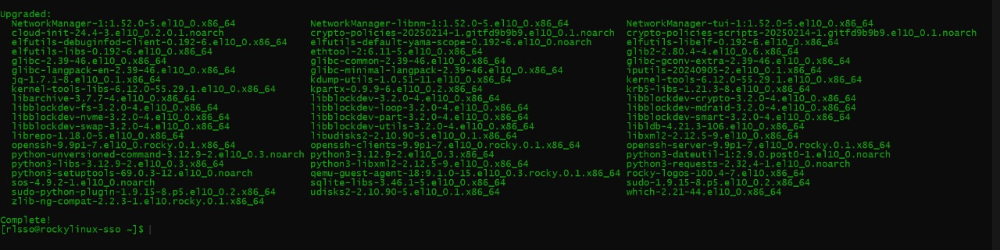

```bash
## I Ran the following command as directed
sudo dnf install epel-release -y
sudo dnf install https://rpms.remirepo.net/enterprise/remi-release-10.rpm -y
sudo dnf module enable php:remi-8.3 -y
sudo dnf install httpd php php-cli php-mysqlnd php-gd php-xml php-mbstring php-json php-fpm mariadb-server python3 python3-pip unzip wget -y
```
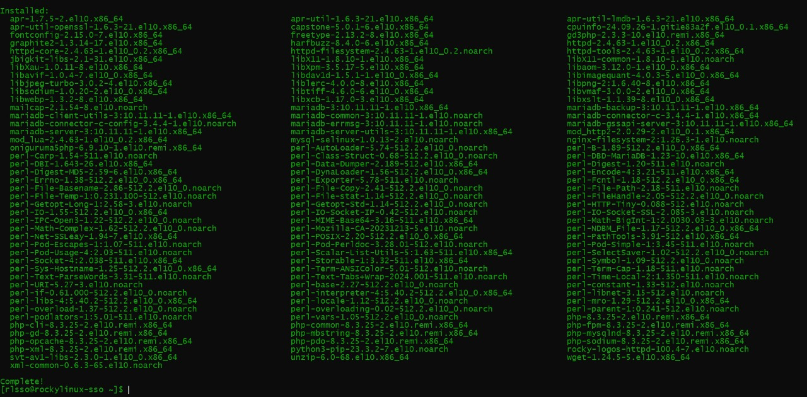
---

### Enabling core services
```
sudo systemctl enable --now httpd
sudo systemctl enable --now php-fpm
sudo systemctl enable --now mariadb
```
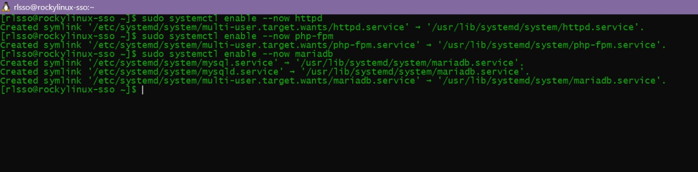
```
sudo mysql_secure_installation
```
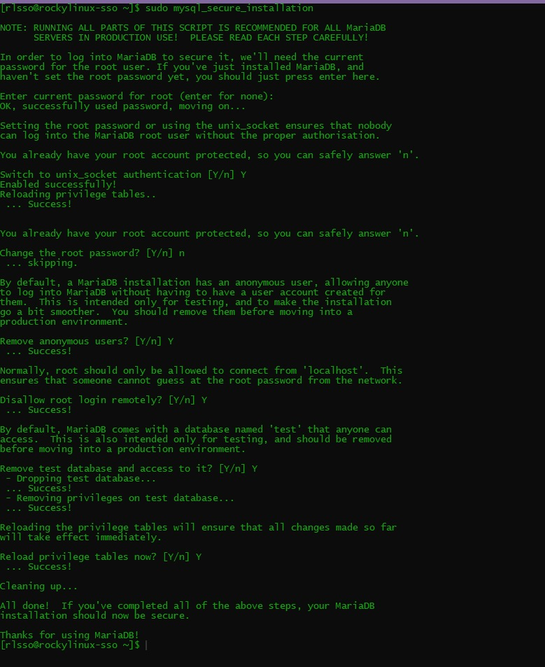
