# Task: Keycloak Setup (Dev mode)
---
## Table of Contents
- [Adding Bootstrap User](#1-adding-bootstrap-user)
- [Running Keycloak](#2-running-keycloak)

This is only for Dev Mode, production Mode is in the next markdown file. 

---

## 1. Adding Bootstrap User

- Download Java and Keycloak  

- The task specified java-17-openjdk-devel, but since Rocky Linux 10  repos no longer provide Java 17, I installed java-21-openjdk and  java-21-openjdk-devel, which are the latest supported packages.

```bash
sudo dnf install java-21-openjdk java-21-openjdk-devel -y
```
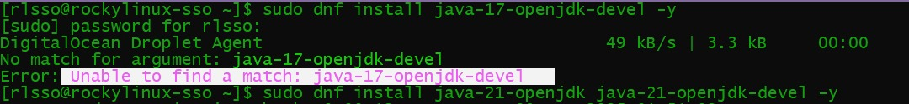

- Install keycloak and rename it
```bash
sudo wget https://github.com/keycloak/keycloak/releases/download/26.3.3/keycloak-26.3.3.zip
sudo unzip keycloak-26.3.3.zip
sudo mv keycloak-26.3.3 keycloak
```

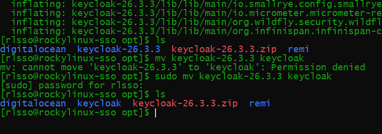
- Change /opt/keycloak ownership from root to keycloak User
```bash
sudo groupadd keycloak
sudo useradd -r -g keycloak -d /opt/keycloak -s /sbin/nologin keycloak
sudo chown -R keycloak:keycloak /opt/keycloak
```
- We can see the id of keycloak user


- Set the SELinux rule for /opt/keycloak and apply it 
```bash
sudo semanage fcontext -a -t usr_t "/opt/keycloak(/.*)?"
sudo restorecon -Rv /opt/keycloa
```
This was necessary to permanently assign the correct SELinux security label (`usr_t`) to the Keycloak application files, allowing system processes to access and execute them from the `/opt/keycloak` directory without being blocked.

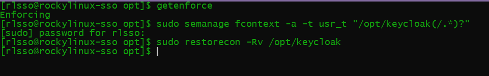

- Build kc.sh needed on first run
```bash
sudo ./bin/kc.sh build
```
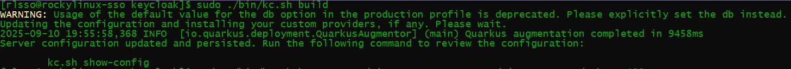

- Create bootstrap user
```bash
export P=my_password
sudo --preserve-env=P ./bin/kc.sh bootstrap-admin user --username admin --password=env P
```
- We have now created the initial bootstrap user

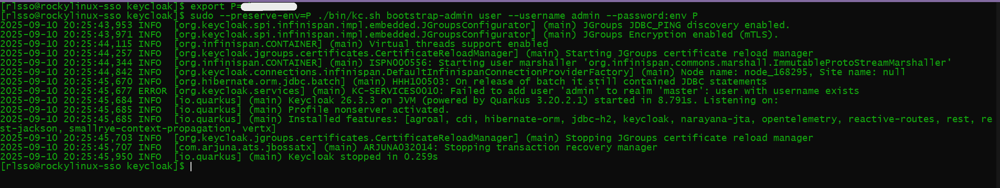

---

## 2. Running Keycloak

- Delete bootstrap user and creating a new admin user  
- Note: The bootstrap admin user is a temporary, initial account. For security, our first step after logging in will be to create a new permanent administrator and delete this temporary one.

- Run as per the instructions:
```bash
sudo -u keycloak /opt/keycloak/bin/kc.sh start-dev --http-port=8080 --http-host=0.0.0.0  
```
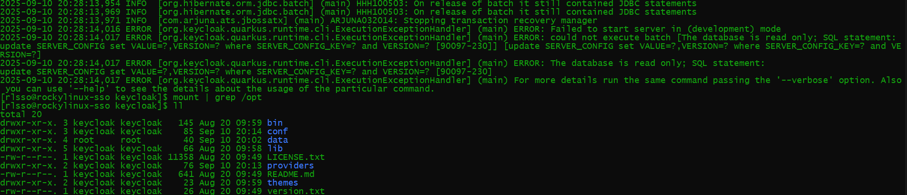

### Problem 1: Read Only File System Exception
- Upon inspecting errors we can see that it says  
```
starting the server failed, the problem was that the database is read only
ReadOnlyFileSystemException
```
- Upon checking keycloak directory we see
```bash
drwxr-xr-x. 4 root     root        40 Sep 10 20:02 data
```
- Data folder is owned by root and not keycloak  
- Change ownership by chown and chmod

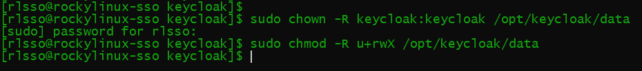

### Problem 2: Newer version of Keycloak does not let us access admin console on HTTP
- Hence we need to use HTTPs

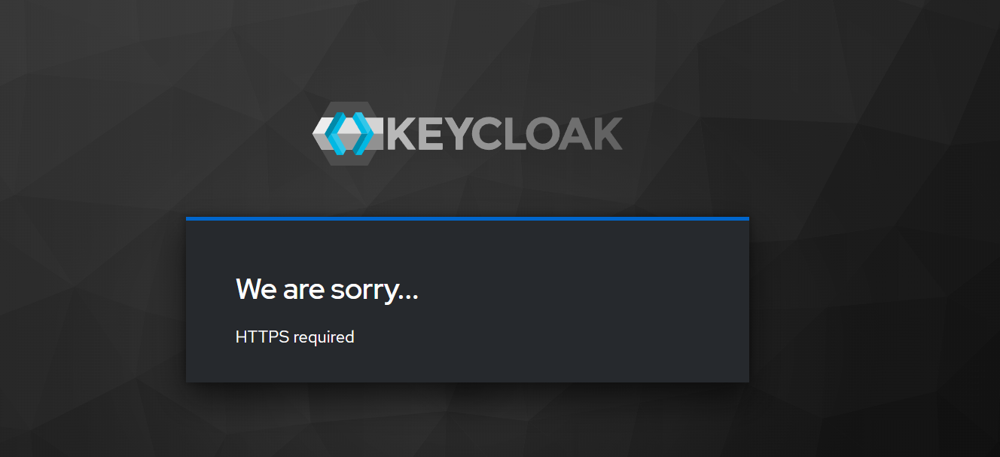

- Create self-signed CA certificates for https since keycloak server is not accepting http

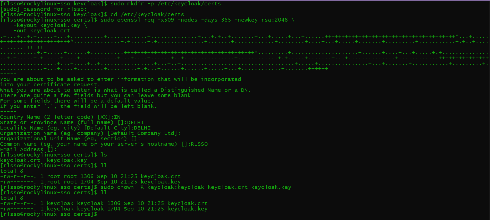

- Then we open port 8443 for https

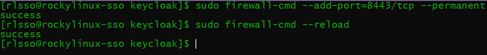

- After this we run the following command to start keycloak 
```bash
sudo -u keycloak ./bin/kc.sh start-dev --https-port=8443  --https-certificate-file=/etc/keycloak/certs/keycloak.crt  --https-certificate-key-file=/etc/keycloak/certs/keycloak.key  --http-host=0.0.0.0

# Run with user keycloak
# Start Dev mode
# Use https port 8443
# Use the said directories when looking for CA certificates
# Listen to requests from all addresses by using host=0.0.0.0
```
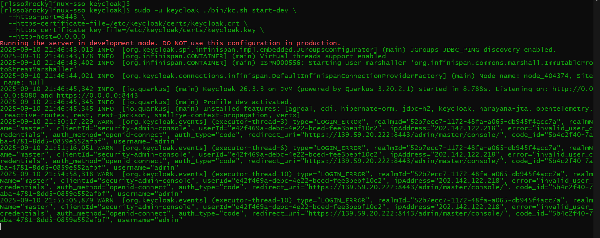

- Once we run the command we can access Keycloak Administrator Console  
- On https://139.59.20.222:8443/  
(Does not work now as keycloak is set from dev to production mode)
  
  - We then go to Admin Console

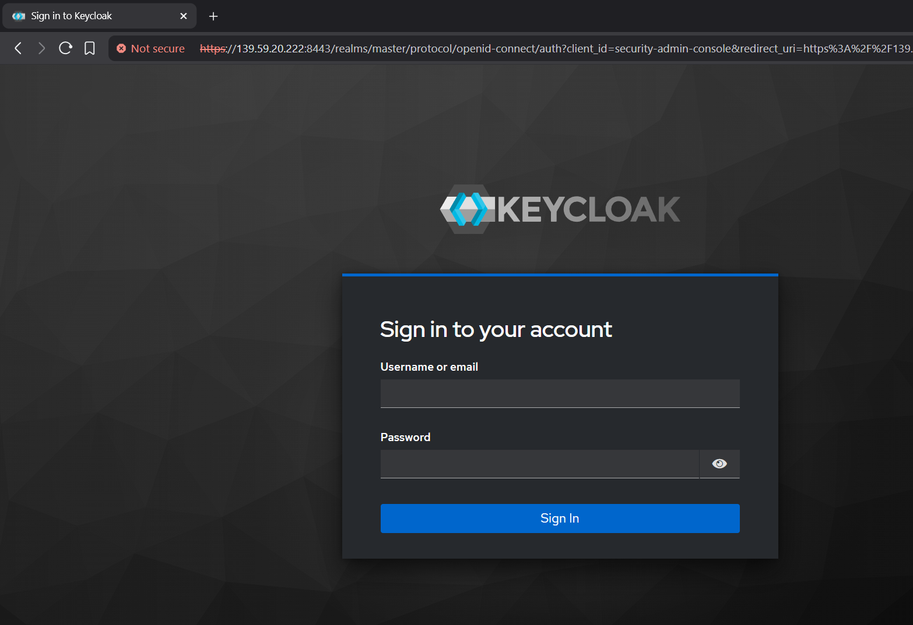

  - We login as bootstrap user

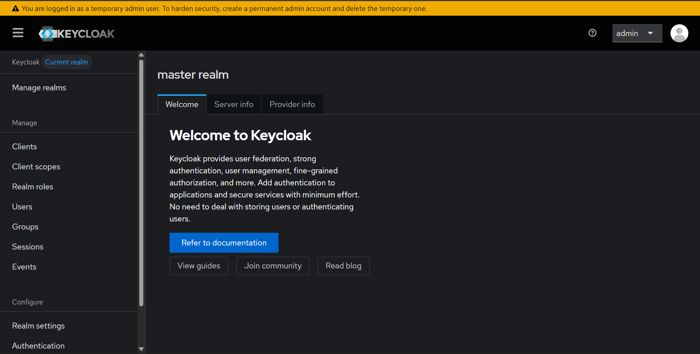

  - We add a new user and delete the bootstrap user

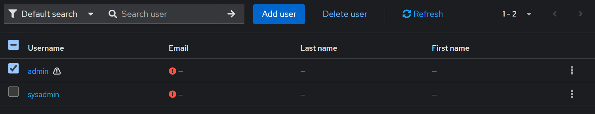

  - We login as our new user (sysadmin) and the bootstrap user is deleted

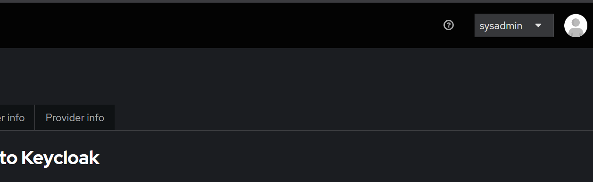
