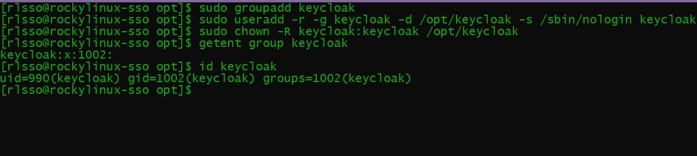

# Task 1: Keycloak Setup (Dev mode)
---
## Table of Contents
- [Adding Bootstrap User](#1-adding-bootstrap-user)
- [Running Keycloak](#2-running-keycloak)
---

## 1. Adding Bootstrap User

We Download Java and Keycloak
The task specified java-17-openjdk-devel, but since Rocky Linux 10  repos no longer provide Java 17, I installed java-21-openjdk and  java-21-openjdk-devel, which are the latest supported packages.

```bash
sudo dnf install java-21-openjdk java-21-openjdk-devel -y
```


```bash
sudo wget https://github.com/keycloak/keycloak/releases/download/26.3.3/keycloak-24.3.3.zip
sudo unzip keycloak-24.0.4.zip
sudo mv keycloak-24.0.4 keycloak
```


```bash
sudo groupadd keycloak
sudo useradd -r -g keycloak -d /opt/keycloak -s /sbin/nologin keycloak
sudo chown -R keycloak:keycloak /opt/keycloak
# Changes /opt/keycloak ownership from root to keycloak User
```
We can see the id of keycloak user


```bash
sudo semanage fcontext -a -t usr_t "/opt/keycloak(/.*)?"
# Sets the SELinux rule for /opt/keycloak  

sudo restorecon -Rv /opt/keycloak
# Applies the rule (relabels files)
```
This was necessary to permanently assign the correct SELinux security label (`usr_t`) to the Keycloak application files, allowing system processes to access and execute them from the `/opt/keycloak` directory without being blocked.


```bash
sudo ./bin/kc.sh build
# Prepares Keycloak by building its configuration (needed before first run).
```


```bash
export P=my_password
# Saves your chosen admin password in an environment variable called P.

sudo --preserve-env=P ./bin/kc.sh bootstrap-admin user --username admin --password=env P
# Creates the first Keycloak admin account ("bootstrap admin") using the password from $P.
# --preserve-env=P makes sure sudo does not strip the P variable.
```

We have now created the initial bootstrap user

## 2. Running Keycloak

Here we delete bootstrap user and creating a new admin user  

We run as per the instructions:
```bash
sudo -u keycloak /opt/keycloak/bin/kc.sh start-dev --http-port=8080 --http-host=0.0.0.0  
```


### Problem 1: Read Only File System Exception
Upon inspecting errors we can see that it says  
```
starting the server failed, the problem was that the database is read only
ReadOnlyFileSystemException
```
upon checking keycloak directory we see
```bash
drwxr-xr-x. 4 root     root        40 Sep 10 20:02 data
```
data folder is owned by root and not keycloak  

Hence we change ownership by chown and chmod


### Problem 2: Newer version of Keycloak does not let us access admin console on HTTP
Hence we need to use HTTPs


Created self-signed CA certificates for https since keycloak server is not accepting http


Then we opened port 8443 for https


After this we run the following command:
```bash
sudo -u keycloak ./bin/kc.sh start-dev --https-port=8443  --https-certificate-file=/etc/keycloak/certs/keycloak.crt  --https-certificate-key-file=/etc/keycloak/certs/keycloak.key  --http-host=0.0.0.0

# Run with user keycloak
# Start Dev mode
# Use https port 8443
# Use the said directories when looking for CA certificates
# Listen to requests from all addresses by using host=0.0.0.0
```

Once we run the command we can access Keycloak Administrator Console  
On https://139.59.20.222:8443/  
(Does not work now as keycloak is set from dev to production mode)
  
  We then go to Admin Console


  We login as bootstrap user


  We add a new user and delete the bootstrap user


  We login as our new user (sysadmin) and the bootstrap user is deleted


