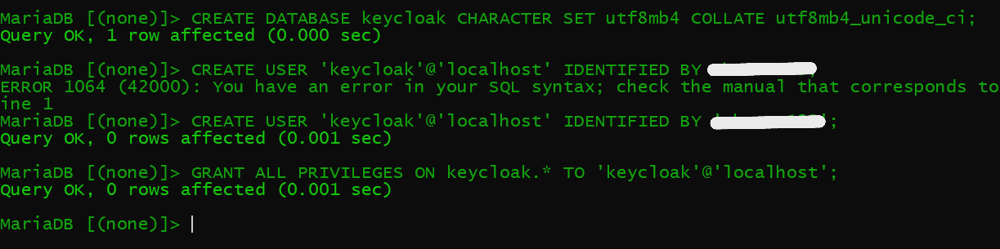
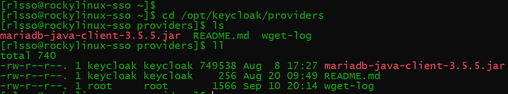
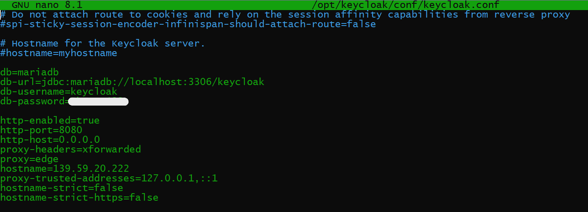
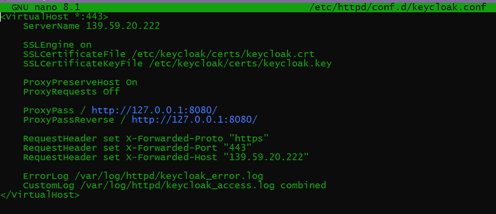
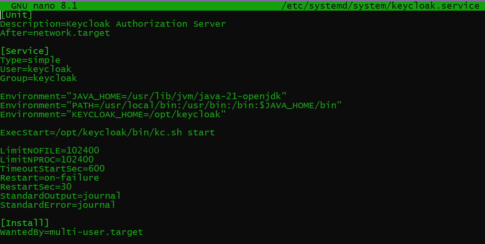
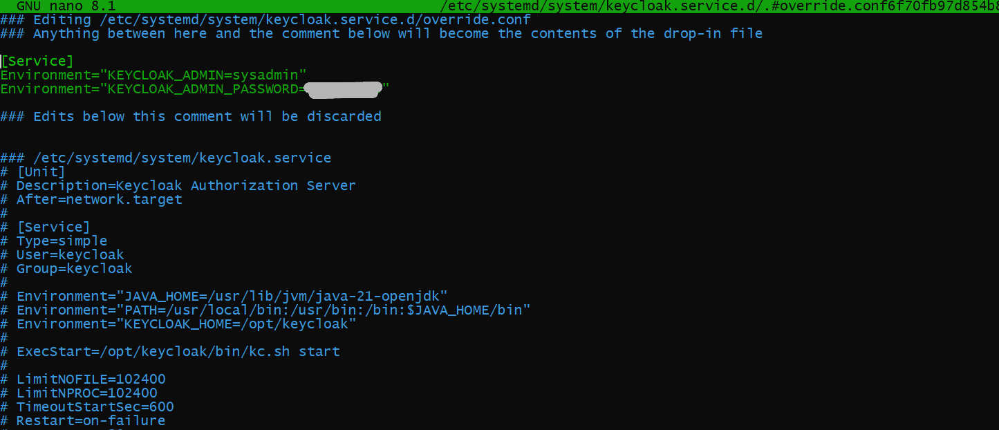
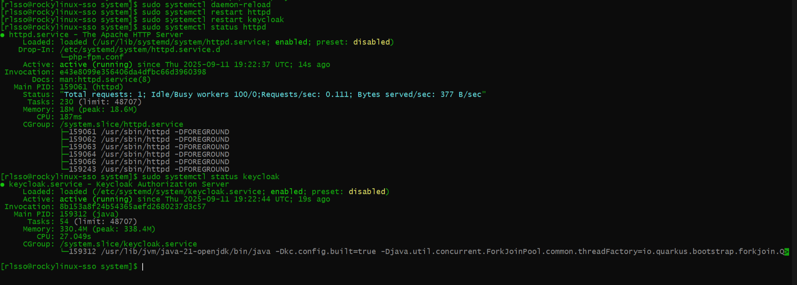
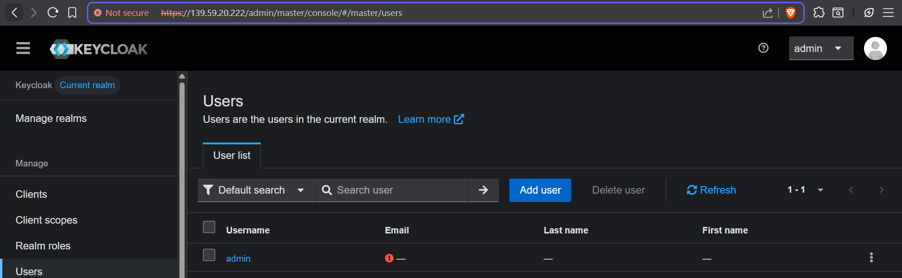

# Task: Keycloak setup (Production mode)
---
## Table of Contents
- [Replace H2 With Mariadb](#1-replace-h2-with-mariadb)
- [Using Apache as a reverse proxy](#2-using-apache-as-a-reverse-proxy)
- [Running keycloak](#3-running-keycloak)
- [Accessing Admin Console on IP](#accessing-admin-console-on-ip)
---

## Goal
In this Task we have 3 Goals  
1. Configuring keycloak with mariadb instead of using h2 as its database.  
2. Put Apache in front of Keycloak as a reverse proxy + SSL termination.  
   Apache handles Https, Keycloak runs as localhost. 
3. Use keycloak Administration Console on a Live website.

---

## 1. Replace H2 With Mariadb

We already had installed Mariadb when we did initial server setup  
We login into Mariadb
```bash
sudo mysql -u root -p
#logs into mariadb
```
We then create a Mariadb database



We confirm that MariaDB JDBC drivers are added to /opt/keycloak/providers



We then add the following lines to /opt/keycloak/conf/keycloak.conf 
```bash
db=mariadb 
db-url=jdbc:mariadb://localhost:3306/keycloak 
db-username=keycloak
db-password=[mypassword]
```


---

## 2. Using Apache as a reverse proxy

We install required packages 
```bash
 sudo dnf install httpd mod_ssl -y 
```

We create a new file /etc/httpd/conf.d/keycloak.conf  
We add the following code in it 



This allows us to set up httpd service  
httpd service runs on my machine's IP address  
  
In this setup the Apache Server listens to whatever is been displayed on http  
127.0.0.1:8080 and forwards it through https on my machines ip address and port 443  

To sync it with our keycloak service we add the following lines in /opt/keycloak/conf/keycloak.conf
```bash
http-enabled=true
http-port=8080
http-host=0.0.0.0
proxy-headers=xforwarded
proxy=edge
hostname=139.59.20.222
proxy-trusted-addresses=127.0.0.1,::1
hostname-strict=false
hostname-strict-https=false
```


---

## 3. Running keycloak

We edit the keycloak.service file at /etc/systemd/system/keycloak.service
and add the following so that when we start the keycloak service it runs both httpd and keycloak



We have user and group set as keycloak, hence only keycloak user runs the service, and not root  
We have also provided the Environments necessary for the service to start

### Problem: We do not have our previously created account 
The previous sysadmin and bootstrap users both were created in H2 database, once we have changed to Mariadb  
We cannot access them again.

Hence we add new temporary user by passing them as environment variables in keycloak.service



Next we build kc.sh using the command
```bash
sudo -u keycloak /opt/keycloak/bin/kc.sh build
```

And we run both services
```bash
sudo systemctl start httpd
sudo systemctl start keycloak
```



---

## Accessing Admin Console on IP

We access website on: https://139.59.20.222/admin  
- Self signed CA certificates, hence it will give errors
- Also does not load everytime, sometimes throws `Something went wrong` errors
- It is recommmended that you should access it without blockers

Next steps I followed:  
1. Logged in with temporary credentials
2. Deleted temp user
3. Created new user  
With new user credentials we can login on our website
  



