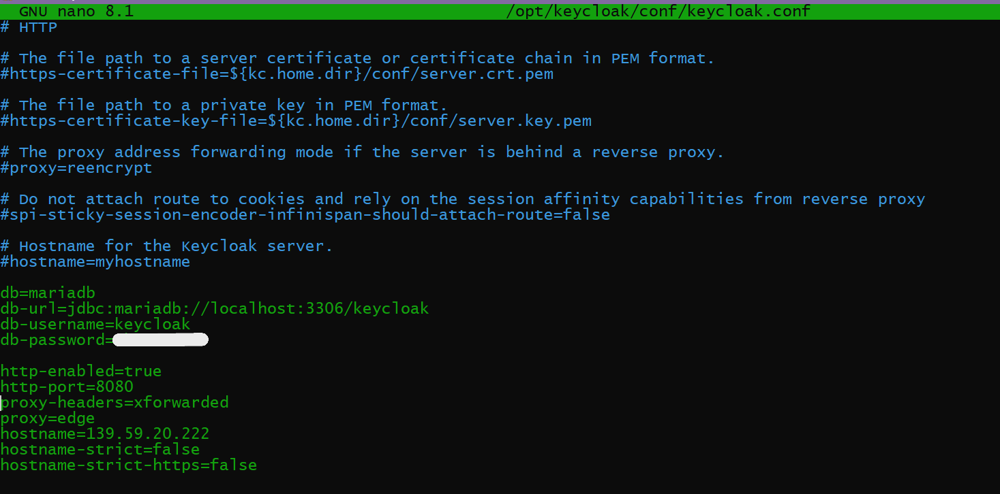
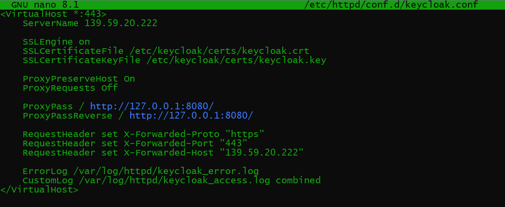

# Task: Keycloak setup (Production mode)
---
## Table of Contents
- [Replace H2 With Mariadb](#1-replace-h2-with-mariadb)
- [Using Apache as a reverse proxy](#2-using-apache-as-a-reverse-proxy)
- [Running keycloak](#3-running-keycloak)
- [Accessing Admin Console on IP](#accessing-admin-console-on-ip)

KEYCLOAK ADMIN CONSOLE: https://139.59.20.222/admin

---

## Goal
In this Task we have 3 Goals  
1. Configuring keycloak with mariadb instead of using h2 as its database.  
2. Put Apache in front of Keycloak as a reverse proxy + SSL termination.  
   Apache handles Https, Keycloak runs as localhost. 
3. Use keycloak Administration Console on a Live website.

---

## 1. Replace H2 With Mariadb

Already had installed Mariadb when did initial server setup  
Login into Mariadb
```bash
sudo mysql -u root -p
#logs into mariadb
```
Then create a Mariadb database


Confirm that MariaDB JDBC drivers are added to /opt/keycloak/providers


Then add the following lines to /opt/keycloak/conf/keycloak.conf 
```bash
db=mariadb 
db-url=jdbc:mariadb://localhost:3306/keycloak 
db-username=keycloak
db-password=[mypassword]
```


---

## 2. Using Apache as a reverse proxy

Install required packages 
```bash
 sudo dnf install httpd mod_ssl -y 
```

Create a new file /etc/httpd/conf.d/keycloak.conf  
Add the following code in it 

 

This allows us to set up httpd service  
httpd service runs on my machine's IP address  
  
In this setup the Apache Server listens to whatever is been displayed on http  
127.0.0.1:8080 and forwards it through https on my machines ip address and port 443  

To sync it with our keycloak service we add the following lines in /opt/keycloak/conf/keycloak.conf
```bash
http-enabled=true
http-port=8080
proxy-headers=xforwarded
proxy=edge
hostname=139.59.20.222
hostname-strict=false
hostname-strict-https=false
```

 

---

## 3. Running keycloak

Edit the keycloak.service file at /etc/systemd/system/keycloak.service
and add the following so that when we start the keycloak service it runs both httpd and keycloak

 

User and group set as keycloak, hence only keycloak user runs the service, and not root  
Provided the Environments necessary for the service to start

### Problem: We do not have our previously created account 
The previous sysadmin and bootstrap users both were created in H2 database, once we have changed to Mariadb  
Cannot access them again.

Hence add new temporary user by passing them as environment variables in keycloak.service


Next build kc.sh using the command
```bash
sudo -u keycloak /opt/keycloak/bin/kc.sh build
```

Run both services
```bash
sudo systemctl start httpd
sudo systemctl start keycloak
```


---

## Accessing Admin Console on IP

Access website on: https://139.59.20.222/admin  
- Self signed CA certificates, hence it will give errors
- Might throw a `Something went wrong` error (Rare)

Next steps I followed:  
1. Logged in with temporary credentials
2. Deleted temp user
3. Created new user  
With new user credentials we can login on our website
  


