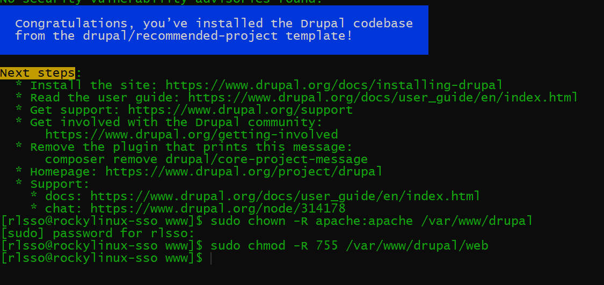
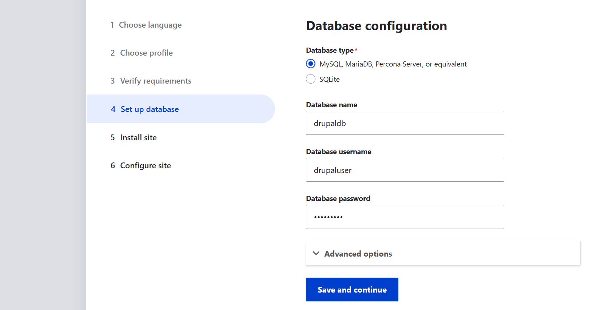
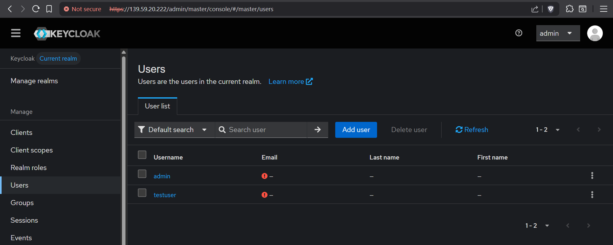
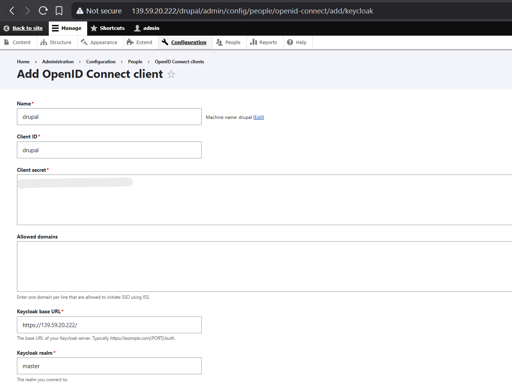

# Task: Integrate Drupal With Keycloak and perform SSO with Keycloak Credentials
---
## Table of Contents
- [Drupal Installation](#1-drupal-installation)
- [Integrating with Keycloak SSO](#2-integrating-with-keycloak-sso)
- [Performing SSO with Keycloak](#3-performing-sso-with-keycloak)

---

## 1. Drupal Installation
We first install composer
```bash
sudo dnf install composer -y 
```
We then create Drupal Database in mariadb


We create composer project in var/www
```bash
cd /var/www/
# Go to /var/www directory
sudo composer create-project drupal/recommended-project drupal
# create project
sudo chown -R apache:apache /var/www/drupal
sudo chmod -R 755 /var/www/drupal/web 
# change ownership of directory
```


```bash
sudo dnf install policycoreutils-python-utils -y
sudo mkdir /var/www/drupal/web/sites/default/files 
# Create the files directory where user uploads will be stored

sudo cp /var/www/drupal/web/sites/default/default.settings.php /var/www/drupal/web/sites/default/settings.php
# Copy the default settings file to create your site's active settings file
```


```bash
sudo nano /var/www/drupal/web/sites/default/settings.php
# edit the new settings.php to add your server's IP as a trusted host
```
Inside Drupal default settings we add the following lines

Here we are adding our machines ip address as a trusted host:


We Allow HTTP client to connect to a server with a self-signed SSL certificate:


We then set SELinux contexts
```bash
sudo semanage fcontext -a -t httpd_sys_rw_content_t "/var/www/drupal(/.*)?"
sudo restorecon -Rv /var/www/drupal/
```
We Tell SELinux that the web server is allowed to read and write content in this directory. This is the persistent method.  

Apply the Contexts: Run restorecon to apply the new SELinux policies to the files immediately.

Next we edit the httpd apache file and map /drupal url path to Drupal Filesystem directory.

```bash
sudo nano /etc/httpd/conf.d/applications.conf
# same file can be used to map /django and /phpapp url paths
```


Next we go to .htaccess file and Modify Rewritebase
We do this to access our Drupal app in /drupal url
```bash
sudo nano /var/www/drupal/web/.htaccess
```


We then go to http://139.59.20.222/drupal/  
We proceed to install Drupal


In Database configuration we give drupal access to our Mariadb database  
We provide it username and password of Database we creared



Once Drupal is installed we login with our maintainance account  
(in this case its admin account)


---

## 2. Integrating with Keycloak SSO

We go to manage > extend > we check Keycloak and install Keycloak Openid Connect


We visit our keycloak administration console  
Then we create a new client - Drupal


We also create another user than admin, called testuser  
Testuser's credentials will be used for keycloak SSO 



We go back to our drupal console  
We go to configurations > people > openid-connect > then we add our Keycloak  client here  



When we use SSO with keycloak

1. The OpenID Connect module on your Drupal site redirects the user's browser to Keycloak to log in.

2. Keycloak validates the user's credentials (username and password).

3. Keycloak gives a temporary, one-time-use Authorization Code back to Drupal (via the user's browser).

4. Drupal's backend server uses that Authorization Code and its own Client Secret to contact Keycloak directly and exchange them for the final ID and Access Tokens.

5. Once Drupal has the tokens and validates the user's identity from them, it creates a local session and logs the user into their Drupal account.

---

## 3. Performing SSO with Keycloak

We test the above sequence 

We first click Log in with Keycloak


The page is redirected to Keycloak login page  
We put in our testuser credentials


Once we click Sign in the page logs us into Drupal using our keycloak client 


The login page is accessible at: http://139.59.20.222/drupal/user/login

