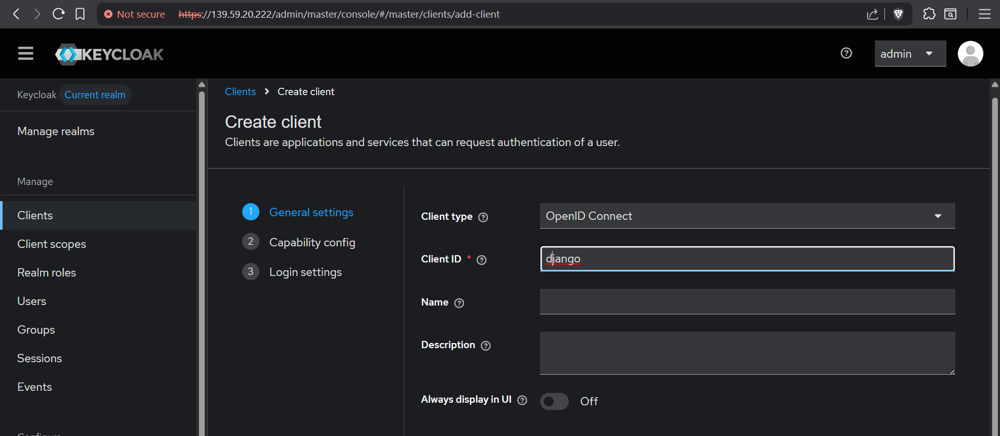

# Task: Integrate Django With Keycloak and perform SSO with Keycloak Credentials
---
## Table of Contents
- [Django Installation](#1-django-installation)
- [Integrating with Keycloak SSO](#2-integrating-with-keycloak-sso)
- [Performing SSO with Keycloak](#3-performing-sso-with-keycloak)

---

## 1. Django Installation


Editing the settings python file

```python
# Database
#https://docs.djangoproject.com/en/5.2/ref/settings/ 
DATABASES = {
    'default': {
        'ENGINE': 'django.db.backends.mysql',
        'NAME': 'djangodb',
        'USER': 'djangouser',
        'PASSWORD': 'your_passoword',
        'HOST': 'localhost',
        'PORT':'3306',
        }
    }
```

```python
TEMPLATES = [
    {
        'BACKEND': 'django.template.backends.django.DjangoTemplates',
        'DIRS': [BASE_DIR / 'templates'],
        'APP_DIRS': True,
        'OPTIONS': {
            'context_processors': [
                'django.template.context_processors.request',
                'django.contrib.auth.context_processors.auth',
                'django.contrib.messages.context_processors.messages',
                ],
            },
    },
]                                                                                                                                 
```
```python
STATIC_URL = '/django/static/'
STATIC_ROOT = BASE_DIR / 'static'
```
```python
AUTHENTICATION_BACKENDS = (
    'mozilla_django_oidc.auth.OIDCAuthenticationBackend',
    'django.contrib.auth.backends.ModelBackend',
)                                                
OIDC_RP_CLIENT_ID = "django"                 
OIDC_RP_CLIENT_SECRET = "client_secret"
OIDC_OP_AUTHORIZATION_ENDPOINT = "https://139.59.20.222/realms/master/protocol/openid-connect/auth"
OIDC_OP_TOKEN_ENDPOINT = "https://139.59.20.222/realms/master/protocol/openid-connect/token"
OIDC_OP_USER_ENDPOINT = "https://139.59.20.222/realms/master/protocol/openid"
OIDC_OP_JWKS_ENDPOINT = "https://139.59.20.222/realms/master/protocol/openid-connect/certs"
OIDC_VERIFY_SSL = False  
LOGIN_REDIRECT_URL = "/django/home"
LOGOUT_REDIRECT_URL = "/"  
FORCE_SCRIPT_NAME = '/django'                                               
```


Next we create superuser in our venv


We edit /etc/systemd/system/gunicorn.service


We also edit 

1. Urls.py

```python
from django.contrib import admin
from .views import login_page, home_page
from django.urls import path, include
urlpatterns = [
    path('admin/', admin.site.urls),
    path('oidc/', include('mozilla_django_oidc.urls')),
    path('', login_page, name='login'),
    path('home/', home_page, name='home')
    ] 
```

2. views.py

```python
from django.shortcuts import render
from django.contrib.auth.decorators import login_required
def login_page(request):return render(request, 'login.html')@login_required
def home_page(request):                         
#After a successful OIDC login, user details are in request.user
user_info = {
'last_name': request.user.last_name,
'email': request.user.email,
'username': request.user.username,} 
# You can render a template or just return a simple response                                                             
return render(request, 'home.html', {'user_info': user_info})
```

Next we edit /etc/httpd/conf.d/applications.conf


We make a templates directory and code out a home and a login HTML page


We collect static files
We run
```bash
python manage.py collectstatic
```
This collects all the static files in our project so they can load faster

We then enable and run gunicorm service


---

## 2. Integrating with Keycloak SSO

Login to our keycloak console  
Create a new user 



We copy client secret key and paste it in settings.py file
```python
OIDC_RP_CLIENT_SECRET = "client_secret"
```

Next we put a valid redirect url and create user


We Restart gunicorn service and change ownership to apache user


---

## 3. Performing SSO with Keycloak

We go to to our login page http://139.59.20.222/django


Once we click on login with Keycloak, we are redirected to keycloak login page  
We put in our testuser credentials which we had created in keycloak


We are successfully redirected to django/home/ page  
Where you can see testuser username and email as we directed in home.html file


