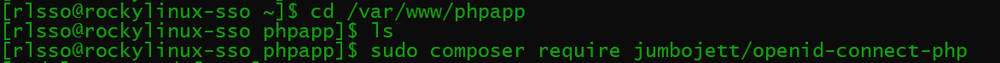
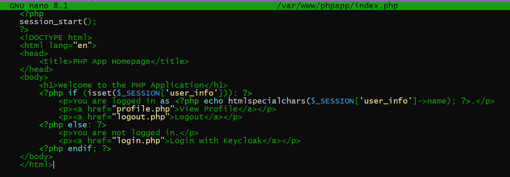
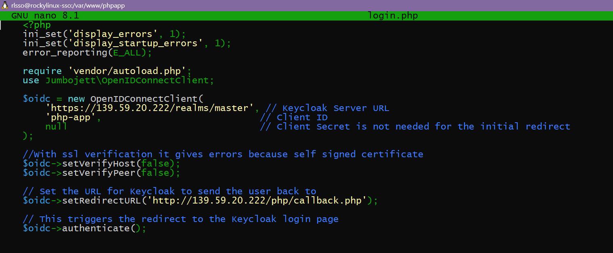
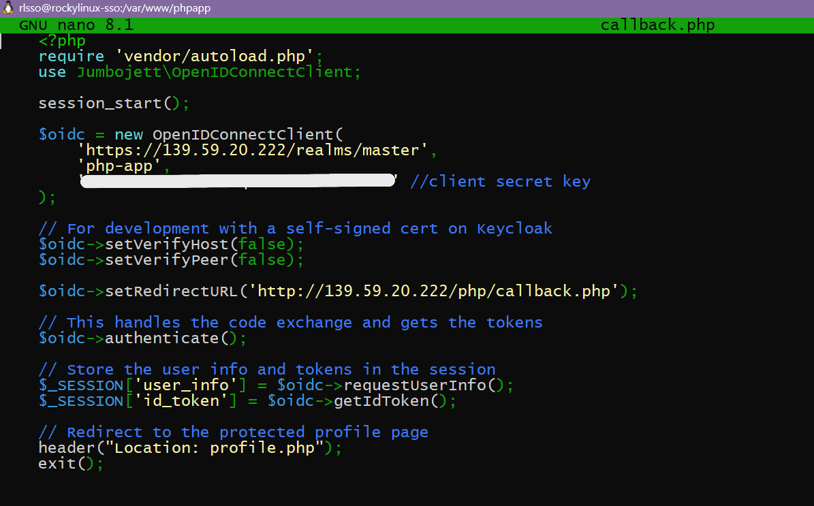
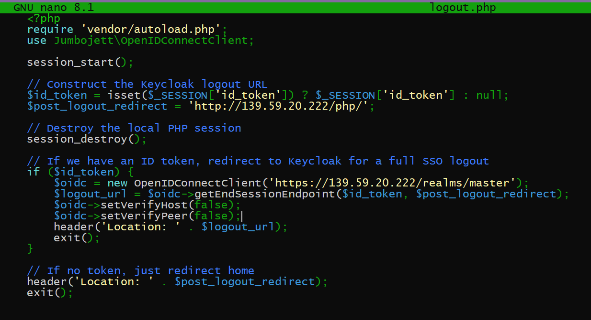
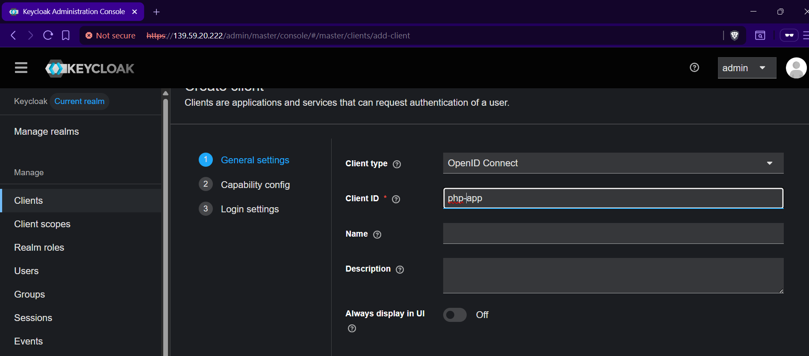
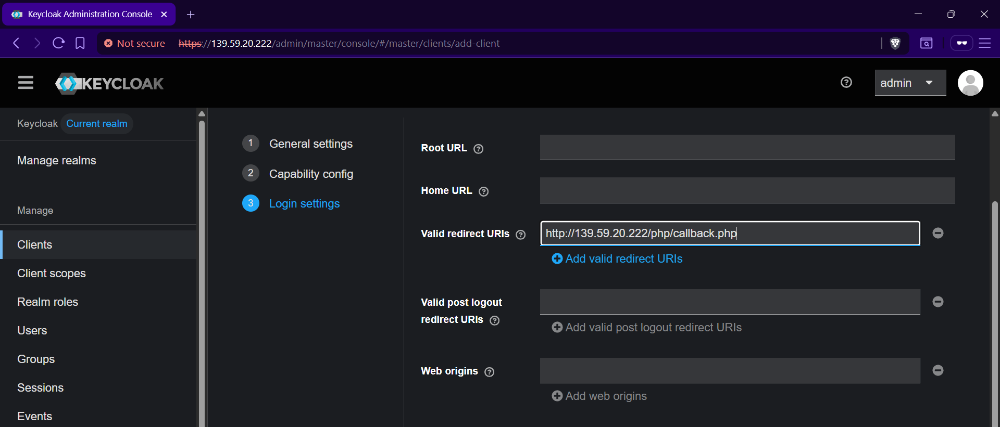
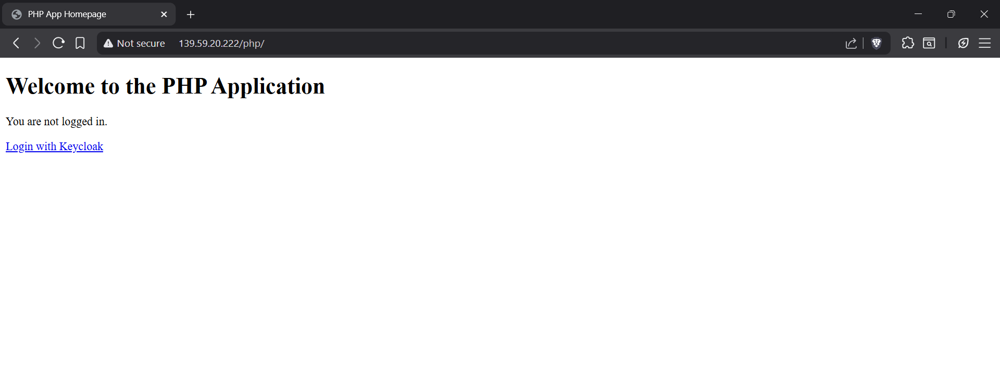
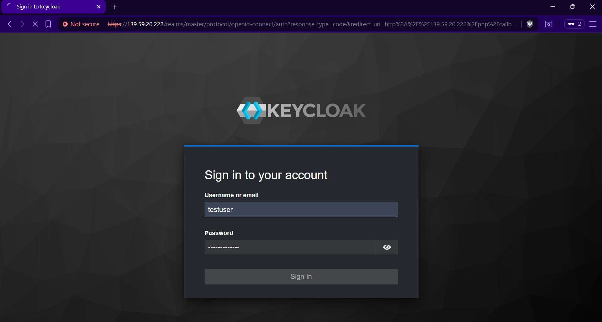
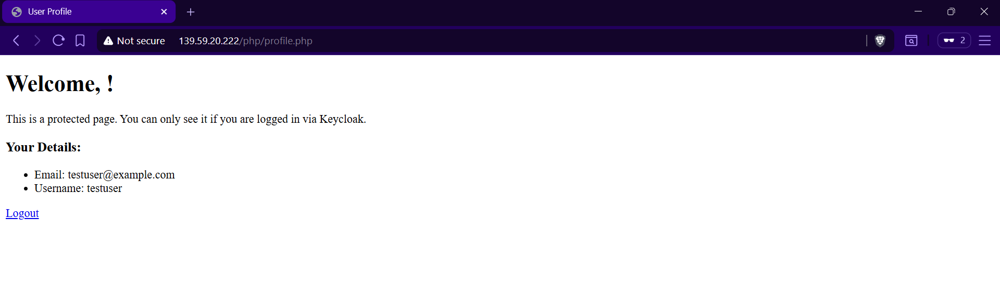

# Task: Integrate PHP With Keycloak and perform SSO with Keycloak Credentials
---
## Table of Contents
- [PHP Installation](#1-php-installation)
- [Integrating with Keycloak SSO](#2-integrating-with-keycloak-sso)
- [Performing SSO with Keycloak](#3-performing-sso-with-keycloak)

PHP APPLICATION: http://139.59.20.222/php/ 

---
## 1. PHP Installation
First, we'll create a dedicated directory for your new PHP application's files.
Install the PHP OIDC Library
```bash
    sudo mkdir /var/www/phpapp
    sudo composer require jumbojett/openid-connect-php
```



Once installed we must create the following files:

1. index.php

```bash
    sudo nano /var/www/phpapp/index.php
```

- Acts as the main entry point: This is the first page users see.

- Checks login status: It checks the PHP session to see if a user is already logged in.

- Displays conditional content: If the user is logged in, it shows a welcome message and links to their profile and logout. If not, it provides a link to log in with Keycloak.



2. login.php

```bash
    sudo nano /var/www/phpapp/login.php
```

- Initiates authentication: Its sole purpose is to start the login process.

- Configures the OIDC client: It sets up the OpenID Connect client with your Keycloak server's details.

- Redirects to Keycloak: It forwards the user's browser to the Keycloak login page to enter their credentials.
  



3. callback.php

```bash
    sudo nano /var/www/phpapp/callback.php
```

- Receives data from Keycloak: After a successful login, Keycloak redirects the user back to this file with an authorization code.

- Authenticates the user: It securely exchanges the code and your client secret for user tokens and information.

- Establishes a local session: It stores the user's information in a PHP session, officially logging them into the application.

- Redirects to a protected page: It sends the now-authenticated user to their profile page.



4. logout.php

```bash
    sudo nano /var/www/phpapp/logout.php
```

- Destroys the local session: It logs the user out of the PHP application by clearing their session data.

- Initiates a global logout: It redirects the user to Keycloak's logout URL to terminate the central SSO session.

- Redirects to the homepage: After the logout process is complete, it sends the user back to the main index.php page.  



---

## 2. Integrating with Keycloak SSO

- We visit our keycloak administration console
- Then we create a new client - php-app




- We put valid redirect URLs and copy client credentials



- Paste Client Credentials in callback.php

```php
$oidc = new OpenIDConnectClient(
        'https://139.59.20.222/realms/master',
        'php-app',
        'client_secret_from_keycloak' 
    );
```
---

## 3. Performing SSO with Keycloak

Go to PHP application http://139.59.20.222/php/

- Click login



- Redirected to Keycloak admin



- Once we login we can see out php homepage


